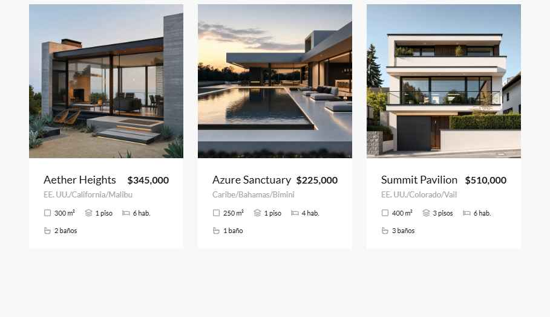

# Zenith Realty — Landing page

Landing page de una inmobiliaria de propiedades premium. Es una página de una sola pantalla larga, con video de fondo en el hero, listado de propiedades destacadas, explicación del servicio y bloque de indicadores de inversión. Todos los llamados a la acción llevan a WhatsApp.



## Secciones

| Sección | Ancla | Contenido |
| --- | --- | --- |
| Hero + navbar | `#hero` | Video a pantalla completa, titular *"Descubre un espacio al que realmente perteneces"*, botón **Reservar una llamada** y menú (drawer lateral en móvil). |
| Propiedades | `#properties` | Grilla de 3 tarjetas con foto, precio, ubicación, superficie, pisos, habitaciones y baños. |
| Servicio y proceso | `#how-it-works` | Tarjeta con los pasos *Análisis de mercado, Colección exclusiva, Soporte legal, Cierre de trato* (el paso activo se resalta al hacer clic) junto a una imagen grande. |
| Inversión | `#investment` | Tres indicadores (crecimiento anual, rendimiento agregado, retorno mediano) con mini gráficos de barras. |

## Stack

- **Formato:** archivo `.dc.html` con componente declarativo (`<x-dc>`) y lógica en una clase `Component`, ejecutado por el runtime incluido en [support.js](support.js).
- **Runtime:** React 18.3.1, ReactDOM y Babel standalone, cargados desde `unpkg.com` por `support.js`.
- **Tipografías:** Lato y Playfair Display (Google Fonts).
- **Estilos:** CSS inline dentro del template, más un media query en `min-width: 768px` que alterna navbar de escritorio y menú móvil.
- Sin `package.json`, sin build step.

## Estructura

```
Zenith Realty landing page/
├── Zenith Realty.dc.html      # La página: template, estilos y lógica del componente
├── support.js                 # Runtime del formato .dc (generado, no editar)
├── uploads/
│   ├── video_mejorado_calidad.mp4   # Video del hero (el que usa la página)
│   ├── hero_video-1789882306392-5l1s.mp4
│   └── draw-*.png             # Bocetos/referencias subidas
├── screenshots/props.png      # Captura de la sección de propiedades
├── _ds/industry-…/            # Sistema de diseño "Industry" (referencia; ver nota)
└── .thumbnail
```

## Cómo verla

Hace falta servirla por HTTP (abrir el archivo con doble clic puede fallar) y tener conexión a internet, porque el runtime y las fuentes se cargan desde CDN.

```bash
# desde la carpeta del proyecto
python -m http.server 8000
# o
npx serve .
```

Después abrir <http://localhost:8000/Zenith%20Realty.dc.html>.

## Cómo editar el contenido

Todo está en [Zenith Realty.dc.html](Zenith%20Realty.dc.html), dentro del método `renderVals()` al final del archivo:

- **Propiedades:** array `properties` (`title`, `price`, `location`, `area`, `floors`, `beds`, `baths`, `image`).
- **Pasos del proceso:** array `processSteps`.
- **Indicadores de inversión:** array `rawCharts` (`title`, `value` y `data` con los valores del gráfico de barras).
- **Video del hero:** atributo `src` del `<video>` en la sección `#hero`.
- **Textos y menú:** directamente en el template HTML.

## Contacto / WhatsApp

Los botones *Reservar una llamada* y *Publicar propiedad* apuntan a `https://wa.me/3549469411`.

## Pendientes conocidos

- **Formato del link de WhatsApp:** `wa.me` espera el número completo con código de país y sin `+` ni ceros (para Argentina móvil: `54 9 <área> <número>`). El link actual `3549469411` no lo incluye, así que conviene revisarlo antes de publicar.
- **Imágenes de las propiedades:** hoy se sirven desde `images.higgs.ai` (URLs externas). Para producción es preferible descargarlas y alojarlas dentro del proyecto.
- **Enlaces del menú:** *Empresa*, *Carreras* y *Blog* apuntan a anclas de la misma página; *Carreras* y *Blog* aún no tienen sección propia.
- **Datos de ejemplo:** propiedades, precios e indicadores son contenido de muestra.
- **Sistema de diseño:** la carpeta `_ds/` contiene el sistema "Industry" (azul acero, Barlow), pero la página actual no lo usa; tiene su propia paleta neutra (`#F8F8F8` / `#141414`) con Lato y Playfair Display.
- **Ejecución sin conexión:** el runtime depende de `unpkg.com`; para uso offline habría que vendorizar React, ReactDOM y Babel.
